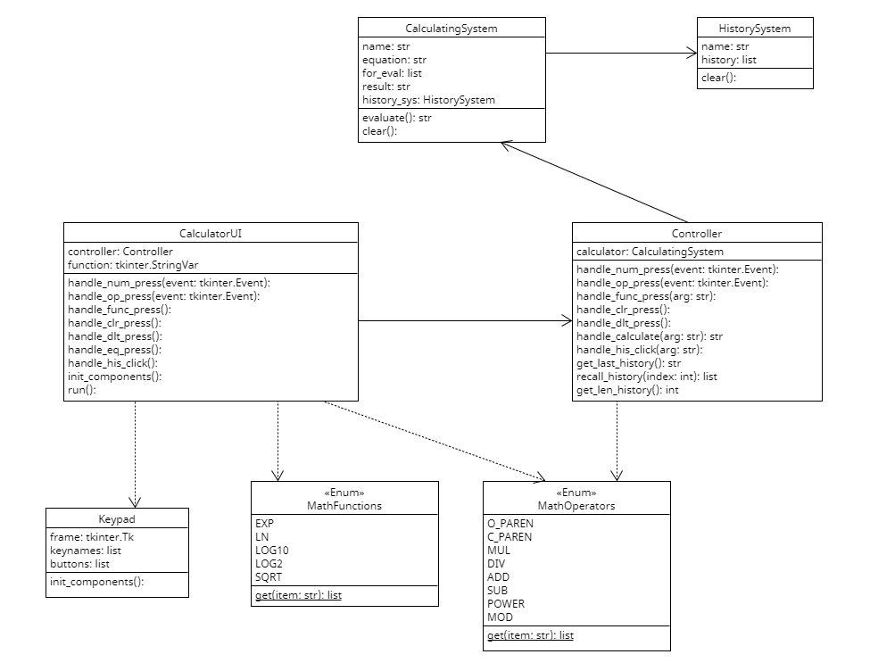

# Calculator

A practical calculator using Python Tkinter graphics.

### Features

* Practical calculator
* Operators including ( ) + - * / ^ mod 
* Functions including exp, ln, log base 10, log2, sqrt (Represent in Combobox)
* History box which show history of both inputs and results and can recall any input or result

## Files
| file               | Description                                            |
|--------------------|--------------------------------------------------------|
| calculator\_ui.py  | The CalculatorUI class for user interface.             |
| controller.py      | Controller class, use for invoking calculating system. |
| calculator\_sys.py | Calculator model that performs calculating and others. |
| math\_functions.py | Enum defining Mathematics functions.                   |
| keypad.py          | Keypad module which inherit from tkinter.Frame         |
| main.py            | main block to run the program.                         |

## UML Class Diagram

